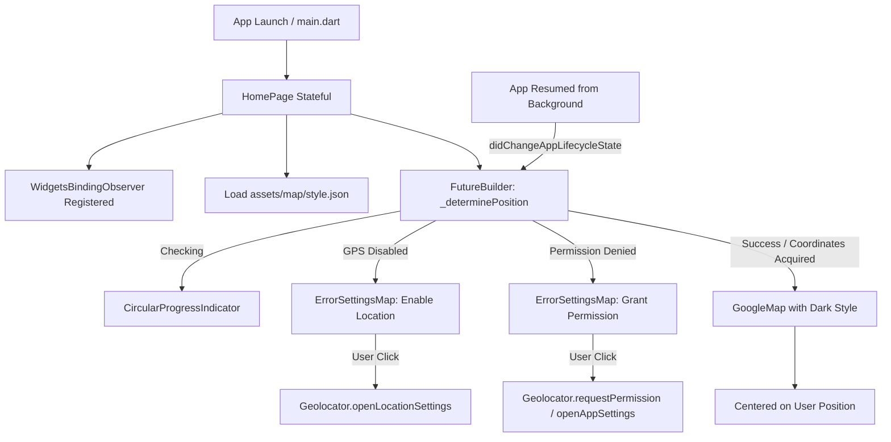

# 🗺️ Clone App Google Maps

[](https://flutter.dev/)
[](https://dart.dev/)
[](https://developers.google.com/maps)
[](https://pub.dev/packages/geolocator)
[](LICENSE)

> 🇧🇷 [**Português**](README.md) | 🇺🇸 **English Version**

A mobile application developed with Flutter that replicates the core visual interface and essential features of Google Maps, including custom dark-mode styling, real-time geolocation tracking, and complete lifecycle and permission management.

## 📌 Quick Navigation

- [📝 About the Project](#-about-the-project)
- [🖼️ Preview](#️-preview)
- [⚡ API Endpoints](#-api-endpoints)
- [✨ Features](#-features)
- [🛠️ Technologies and Tools Used](#️-technologies-and-tools-used)
- [🏛️ Solution Architecture](#️-solution-architecture)
- [📁 Repository Structure](#-repository-structure)
- [💡 Technical Decisions](#-technical-decisions)
- [🚀 How to Run the Project](#-how-to-run-the-project)

## 📝 About the Project

The **Clone App Google Maps** is a mobile application developed in **Flutter** focused on replicating the main visual and interactive features of the Google Maps mobile app.

The project highlights custom Google Maps styling via a dedicated JSON vector style file (`style.json`), accurate user coordinate detection through device GPS sensors, and robust exception-handling flows for disabled location services and denied permissions.

## 🖼️ Preview

<div align="center">
  
</div>

## ⚡ API Endpoints

This project interacts with mapping and telemetry services using native SDKs:

| Service | Provider / Protocol | Purpose |
| :--- | :--- | :--- |
| **Maps SDK for Android / iOS** | Google Cloud Console (`com.google.android.geo.API_KEY`) | Vector map rendering, camera controls, and styling |
| **Location Services (GPS / Network)** | Native (Android Location Services / iOS CoreLocation) | Coordinate capture (`Latitude`, `Longitude`) via `geolocator` |

## ✨ Features

- 📍 **Real-Time Geolocation**: Captures precise device coordinates to position the initial camera view on the user's current location.
- 🎨 **Custom Dark Theme Map Styling**: Asynchronous loading of vector style JSON (`assets/map/style.json`) applied directly to the base map.
- 🛡️ **Resilient Permission & Service Management**:
  - Detection of disabled GPS services with dedicated feedback UI and direct action button to system settings (`Geolocator.openLocationSettings()`).
  - Handling of denied permissions with dialogs and redirection to app settings (`Geolocator.openAppSettings()`) upon permanent denial (`deniedForever`).
- 🔄 **App Lifecycle Synchronization (`WidgetsBindingObserver`)**: Automatic reassessment of location status and permissions when returning from the background (`AppLifecycleState.resumed`).
- 🧭 **Material Design 3 Bottom Navigation Bar**: Custom styled `NavigationBar` featuring *Explore*, *Saved*, and *Contribute* destinations.

## 🛠️ Technologies and Tools Used

| Layer / Purpose | Technology | Description |
| :--- | :--- | :--- |
| **Main Framework** | **Flutter (SDK ^3.10.7)** | Declarative cross-platform UI framework for mobile |
| **Programming Language** | **Dart** | Statically typed language with Null Safety and reactive support |
| **Map Rendering** | **google_maps_flutter 2.17.0** | Official plugin for Google Maps Platform SDK integration |
| **Geolocation Service** | **geolocator 14.0.2** | Geographic location retrieval and native permission handling |
| **UI & Icons** | **Material 3 / cupertino_icons 1.0.8** | Modern design system with vector icon support |
| **Map Styling** | **JSON Assets (`style.json`)** | Thematic map custom styling loaded via `rootBundle` |
| **Code Quality** | **flutter_lints 6.0.0** | Static analysis and best practice lint rules for Dart/Flutter |

## 🏛️ Solution Architecture

The application flow follows a reactive state pattern using `FutureBuilder` combined with lifecycle-driven re-evaluations:



## 📁 Repository Structure

```text
7-clone-app-google-maps/
├── android/                   # Native Android configuration (Manifest, API Keys)
├── assets/
│   ├── images/
│   │   └── clone-maps.gif     # Preview demonstration GIF
│   └── map/
│       └── style.json         # Google Maps custom vector style (Dark Theme)
├── ios/                       # Native iOS configuration
├── lib/
│   ├── pages/
│   │   └── home/
│   │       ├── widget/
│   │       │   └── error_settings_map.widget.dart # Reusable permission error handler widget
│   │       └── home.page.dart # Main screen with GoogleMap and BottomNavigationBar
│   └── main.dart              # Flutter application entrypoint
├── analysis_options.yaml      # Dart static analysis rules
├── pubspec.yaml               # Project dependencies and asset declarations
└── README.md                  # Project documentation
```

## 💡 Technical Decisions

- **Declarative Error Handling with `FutureBuilder`**: Isolates map creation until location coordinates are fetched or triggers appropriate action screens if permissions/services are missing.
- **Reactive Lifecycle Monitoring (`WidgetsBindingObserver`)**: Re-evaluates GPS availability as soon as the user returns from operating system settings, offering a seamless UX without restarting the application.
- **Component Decoupling**: Extracted `ErrorSettingsMap` into an independent widget to separate feedback/action views from the core map presentation logic.
- **Decoupled Vector Styling**: The custom theme in `style.json` is loaded dynamically from assets via `rootBundle`, allowing effortless theme updates without recompiling native code.

## 🚀 How to Run the Project

### Prerequisites

- [Flutter SDK](https://docs.flutter.dev/get-started/install) installed and configured in your PATH.
- [Android Studio](https://developer.android.com/studio) or VS Code with Flutter/Dart extensions.
- Physical device or emulator with Google Play Services enabled.
- Google Maps API Key configured in `android/app/src/main/AndroidManifest.xml` (or via `MAPS_API_KEY` variable).

### Step by Step

1. **Clone the repository**:
   ```bash
   git clone https://github.com/ludson96/7-clone-app-google-maps.git
   cd 7-clone-app-google-maps
   ```

2. **Install dependencies**:
   ```bash
   flutter pub get
   ```

3. **Run the application**:
   ```bash
   flutter run
   ```

<div align="center">
  Developed by <strong>Ludson Pereira dos Santos</strong> 🚀<br />
  <a href="https://www.linkedin.com/in/ludson96/">LinkedIn</a> • <a href="https://github.com/ludson96">GitHub</a> • <a href="mailto:ludson_ps27@hotmail.com">E-mail</a>
</div>
