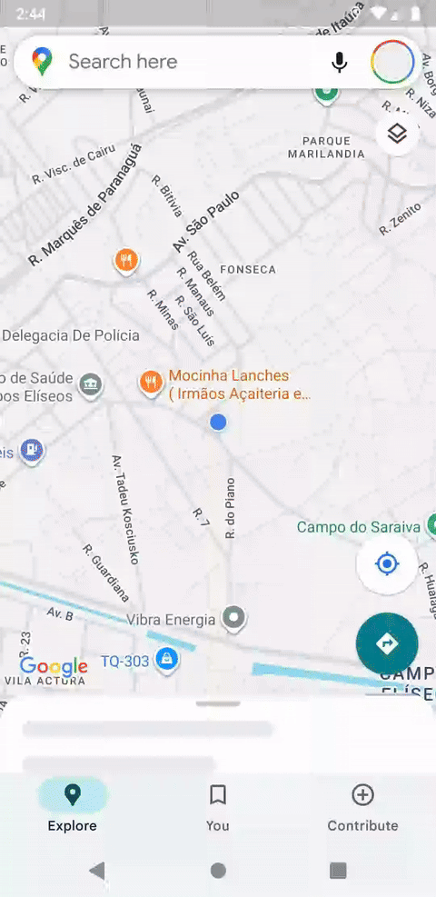

# 🗺️ Clone App Google Maps

🌍 Read this in [English](README.en.md)

Um aplicativo mobile em Flutter que replica a interface e funcionalidades essenciais do Google Maps com mapa customizado e localização em tempo real.

## 📝 Sobre o Projeto

O **Clone App Google Maps** é uma aplicação mobile desenvolvida em Flutter que busca reproduzir a experiência e a interface visual do Google Maps. 

O projeto conta com integração com mapas em tempo real, detecção precisa de localização via GPS, tratamento completo de estados e permissões de localização, e navegação via barra inferior (Bottom Navigation Bar) seguindo as diretrizes do Material Design 3.

> 🎨 **Estilo Próprio do Mapa:** O aplicativo conta com um tema escuro (*Dark Theme*) customizado e exclusivo para o mapa, configurado através do arquivo de estilo próprio localizado em `assets/map/style.json`.

## 🖼️ Tela (Preview)



## ✨ Funcionalidades

- 📍 **Localização em Tempo Real:** Identificação da posição atual do usuário com centralização no mapa.
- 🎨 **Estilização Customizada do Mapa:** Aplicação de visual personalizado (*Dark Mode*) através do arquivo `assets/map/style.json`.
- ⚙️ **Tratamento Inteligente de Permissões e Serviços:**
  - Identificação de serviço de GPS desativado com redirecionamento direto para a tela de configurações de localização do dispositivo.
  - Solicitação de permissão de localização com fluxo para redirecionamento às configurações do aplicativo em caso de recusa permanente.
- 🔄 **Sincronização de Ciclo de Vida (*App Lifecycle*):** Reavaliação automática da localização e permissões quando o aplicativo retorna do segundo plano (*background*).
- 🧭 **Barra de Navegação Inferior (Material 3):** Navegação fluida entre as abas *Explorar*, *Salvos* e *Contribuir*.

## 🛠️ Tecnologias Utilizadas

- **[Flutter](https://flutter.dev/)** - Framework para desenvolvimento mobile multiplataforma.
- **[Dart](https://dart.dev/)** - Linguagem de programação.
- **[google_maps_flutter](https://pub.dev/packages/google_maps_flutter)** - Plugin para renderização e manipulação do Google Maps.
- **[geolocator](https://pub.dev/packages/geolocator)** - Plugin para acesso aos serviços de geolocalização e gestão de permissões de GPS.
- **JSON (Assets)** - Configuração de estilo vetorial e tematização do mapa (`assets/map/style.json`).

## 🚀 Como Executar o Projeto

Para rodar este projeto em sua máquina local, você precisará ter o Flutter instalado. Depois, siga os passos abaixo:

1.  **Clone o repositório** (se estiver usando git):
    ```bash
    git clone https://github.com/ludson96/7-clone-app-google-maps.git

    cd 7-clone-app-google-maps
    ```

2.  **Instale as dependências** com o Flutter:
    ```bash
    flutter pub get
    ```

3.  **Execute o aplicativo**:
    ```bash
    flutter run
    ```
