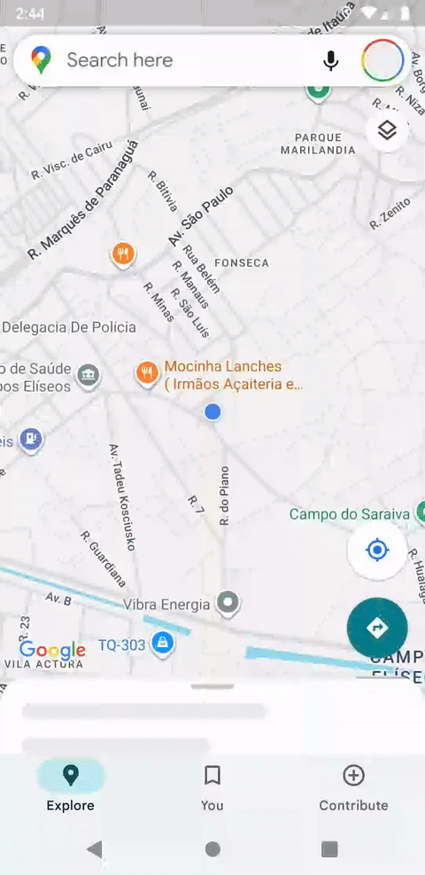
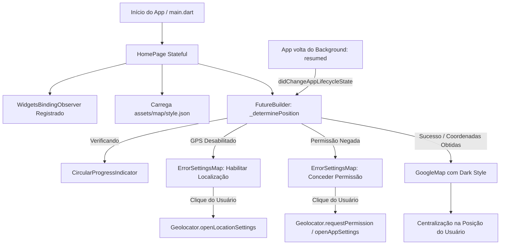

# 🗺️ Clone App Google Maps

[](https://flutter.dev/)
[](https://dart.dev/)
[](https://developers.google.com/maps)
[](https://pub.dev/packages/geolocator)

> 🇧🇷 **Português** | 🇺🇸 [**English Version**](README.en.md)

Aplicativo mobile desenvolvido em Flutter que reproduz a experiência e os recursos essenciais do Google Maps, incluindo renderização com tema escuro personalizado, geolocalização em tempo real e tratamento completo de permissões e ciclo de vida.

## 📌 Navegação Rápida

- [📝 Sobre o Projeto](#-sobre-o-projeto)
- [🖼️ Preview](#️-preview)
- [⚡ API Endpoints](#-api-endpoints)
- [✨ Funcionalidades](#-funcionalidades)
- [🛠️ Tecnologias e Ferramentas Utilizadas](#️-tecnologias-e-ferramentas-utilizadas)
- [🏛️ Arquitetura da Solução](#️-arquitetura-da-solução)
- [📁 Estrutura do Repositório](#-estrutura-do-repositório)
- [💡 Decisões Técnicas](#-decisões-técnicas)
- [🚀 Como Executar o Projeto](#-como-executar-o-projeto)

## 📝 Sobre o Projeto

O **Clone App Google Maps** é um projeto desenvolvido em **Flutter** focado em replicar as principais funcionalidades visuais e interativas do aplicativo do Google Maps para dispositivos móveis.

A aplicação se destaca pelo uso do Google Maps SDK customizado através de um arquivo de estilização vetorial (`style.json`), pela obtenção precisa das coordenadas do usuário utilizando o GPS nativo do dispositivo e pela gestão robusta de fluxos de exceção — tais como serviços de localização desativados e permissões negadas pelo usuário.

## 🖼️ Preview



## ⚡ API Endpoints

Este projeto consome serviços de mapas e telemetria através dos SDKs nativos:

| Serviço | Provedor / Protocolo | Finalidade |
| :--- | :--- | :--- |
| **Maps SDK for Android / iOS** | Google Cloud Console (`com.google.android.geo.API_KEY`) | Renderização de mapas vetoriais, controle de câmera e estilização |
| **Location Services (GPS / Network)** | Nativo (Android Location Services / iOS CoreLocation) | Coleta de coordenadas (`Latitude`, `Longitude`) via `geolocator` |

## ✨ Funcionalidades

- 📍 **Geolocalização em Tempo Real**: Captura a latitude e longitude exatas do dispositivo para posicionar a câmera inicial no local do usuário.
- 🎨 **Estilização Dark Mode Personalizada**: Carregamento assíncrono de JSON de estilo vetorial (`assets/map/style.json`) aplicado diretamente sobre o mapa base.
- 🛡️ **Tratamento Resiliente de Permissões**:
  - Detecção de GPS desligado com tela informativa e botão direto para as configurações do sistema (`Geolocator.openLocationSettings()`).
  - Tratamento para permissões negadas com diálogo e redirecionamento para as configurações do app (`Geolocator.openAppSettings()`) em caso de negação permanente (`deniedForever`).
- 🔄 **Monitoramento do Ciclo de Vida do App (`WidgetsBindingObserver`)**: Atualização e reavaliação automática da localização e permissões no evento `AppLifecycleState.resumed`.
- 🧭 **Barra de Navegação Inferior Material Design 3**: Componente `NavigationBar` com abas estilizadas (*Explorar*, *Salvos*, *Contribuir*).

## 🛠️ Tecnologias e Ferramentas Utilizadas

| Camada / Finalidade | Tecnologia | Descrição |
| :--- | :--- | :--- |
| **Framework Principal** | **Flutter (SDK ^3.10.7)** | Framework declarativo e multiplataforma para UI móvel |
| **Linguagem de Programação** | **Dart** | Tipagem estática com suporte a Null Safety e programação reativa |
| **Renderização de Mapas** | **google_maps_flutter 2.17.0** | Plugin oficial para integração com Google Maps Platform SDK |
| **Serviço de Geolocalização** | **geolocator 14.0.2** | Obtenção de localização geográfica e gestão de permissões nativas |
| **Interface & Ícones** | **Material 3 / cupertino_icons 1.0.8** | Design System moderno com suporte a ícones vetoriais |
| **Estilização de Mapas** | **JSON Assets (`style.json`)** | Personalização temática do mapa aplicada via `rootBundle` |
| **Padronização de Código** | **flutter_lints 6.0.0** | Conjunto de regras estáticas e boas práticas da comunidade |

## 🏛️ Arquitetura da Solução

O fluxo de funcionamento da aplicação segue um padrão reativo com gerenciamento de estado por `FutureBuilder` e sincronização via ciclo de vida:


```mermaid
graph TD
    A[Início do App / main.dart] --> B[HomePage Stateful]
    B --> C[WidgetsBindingObserver Registrado]
    B --> D[Carrega assets/map/style.json]
    B --> E[FutureBuilder: _determinePosition]
    
    E -->|Verificando| F[CircularProgressIndicator]
    
    E -->|GPS Desabilitado| G[ErrorSettingsMap: Habilitar Localização]
    G -->|Clique do Usuário| H[Geolocator.openLocationSettings]
    
    E -->|Permissão Negada| I[ErrorSettingsMap: Conceder Permissão]
    I -->|Clique do Usuário| J[Geolocator.requestPermission / openAppSettings]
    
    E -->|Sucesso / Coordenadas Obtidas| K[GoogleMap com Dark Style]
    K --> L[Centralização na Posição do Usuário]
    
    M[App volta do Background: resumed] -->|didChangeAppLifecycleState| E
```

## 📁 Estrutura do Repositório

```text
7-clone-app-google-maps/
├── android/                   # Configurações nativas Android (Manifest, API Keys)
├── assets/
│   ├── images/
│   │   └── clone-maps.gif     # GIF de demonstração para preview
│   └── map/
│       └── style.json         # Estilo customizado do Google Maps (Dark Theme)
├── ios/                       # Configurações nativas iOS
├── lib/
│   ├── pages/
│   │   └── home/
│   │       ├── widget/
│   │       │   └── error_settings_map.widget.dart # Widget reutilizável para erros de permissão
│   │       └── home.page.dart # Tela principal com GoogleMap e BottomNavigationBar
│   └── main.dart              # Ponto de entrada da aplicação Flutter
├── analysis_options.yaml      # Regras de linting do Dart
├── pubspec.yaml               # Gerenciador de dependências e assets
└── README.md                  # Documentação do projeto
```

## 💡 Decisões Técnicas

- **Tratamento Declarativo de Estados de Erro**: O uso de `FutureBuilder` integrado ao método assíncrono `_determinePosition()` isola a renderização do mapa até que as coordenadas estejam disponíveis ou exibe telas de ação dedicadas caso falte permissão.
- **Ciclo de Vida Reativo (`WidgetsBindingObserver`)**: A aplicação revalida o estado do GPS assim que o usuário retorna das configurações do sistema operacional, garantindo uma experiência contínua sem necessidade de reiniciar o app.
- **Separação de Componentes**: O widget `ErrorSettingsMap` foi modularizado para desacoplar a lógica de exibição de avisos e ações do container principal de mapas.
- **Estilização Vetorial Desacoplada**: A folha de estilo `style.json` fica desacoplada do código Dart e é carregada via `rootBundle`, facilitando alterações de layout e skins de mapas sem recompilação de código nativo.

## 🚀 Como Executar o Projeto

### Pré-requisitos

- [Flutter SDK](https://docs.flutter.dev/get-started/install) instalado e configurado no PATH.
- [Android Studio](https://developer.android.com/studio) ou VS Code com extensões Flutter/Dart.
- Dispositivo físico ou emulador com serviços do Google Play configurados.
- Chave de API do Google Maps configurada no `android/app/src/main/AndroidManifest.xml` (ou via variável `MAPS_API_KEY`).

### Passo a Passo

1. **Clone o repositório**:
   ```bash
   git clone https://github.com/ludson96/7-clone-app-google-maps.git
   cd 7-clone-app-google-maps
   ```

2. **Instale as dependências**:
   ```bash
   flutter pub get
   ```

3. **Execute o projeto**:
   ```bash
   flutter run
   ```

<div align="center">
  Desenvolvido por <strong>Ludson Pereira dos Santos</strong> 🚀<br />
  <a href="https://www.linkedin.com/in/ludson96/">LinkedIn</a> • <a href="https://github.com/ludson96">GitHub</a> • <a href="mailto:ludson_ps27@hotmail.com">E-mail</a>
</div>
